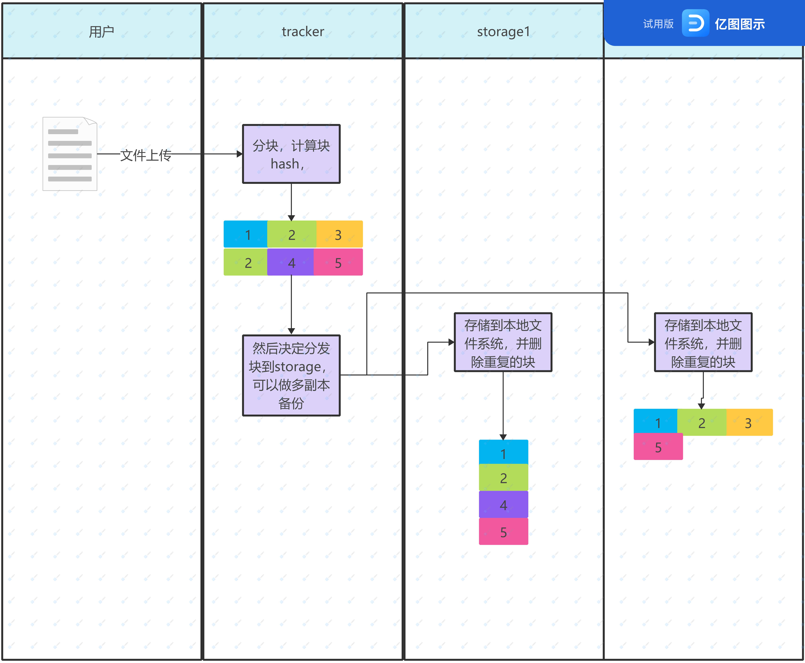

# ddfs-go

simple distributed file system in go

# 需求

功能需求
1. 实现文件上传，下载，删除

技术需求
1. 使用分布式存储
2. 实现块级重复数据删除

# 实现方案

> 参考gfs论文和dfs-go实现

整体上拆解成两个app: 
- storage服务：提供块级存储及重复数据删除
- tracker服务：提供分布式的文件级存储

文件上传流程：

下载和删除的流程类似

## storage服务
使用gin框架提供了一些RESTful的api。
1. 添加块
2. 删除块
3. 获取块

## tracker服务
同上
1. 添加文件
2. 删除文件
3. 获取文件

## 遇到的问题与方案

1. 实现分布式文件系统，要不要使用已有的文件系统？
    1. 实现驱动没有必要。
    2. 物理块的模拟可以做，但完全使用块其实也很困难，文件系统需要的部分结构化信息也需要存储，总的来说，还是尽量简化了，只有文件本身的存储是块，使用位图决定块的索引,文件系统的信息被简单序列化成json保存在本地文件系统, 而没有存储在块中。
    3. 如果要存在块中，应该也不困难，只需要划出一个超级块给文件系统使用，然后把json的字符串存在这个块中即可。

2. 使用什么方式进行主机间通信？
    1. 网络===> TCP/UDP===> socket/http
    2. 肯定是通过网络，其他的方式也没那个设备基础
    3. UDP不考虑吧，太复杂，Socket也太底层了，还得自己写server，不划算
    4. 综合考虑后，使用http协议，简单好用

3. 为什么使用go？而不是c/c++/python
    1. 简单，语法也就比python复杂一点
    2. 刚好熟悉，也在学习go
    3. 其他的语言规范不好把握

4. 设计思路？
    1. 老师的要求是实现重复数据删除，我的描述变成了块级重复数据删除
    2. 核心概念，【块】=> 数据块(block)
    3. 块如何管理？ => 需要一个块管理器 => 演化成了storage
    4. 文件如何存储？ => 需要分块和分发 => 演化成了tracker

